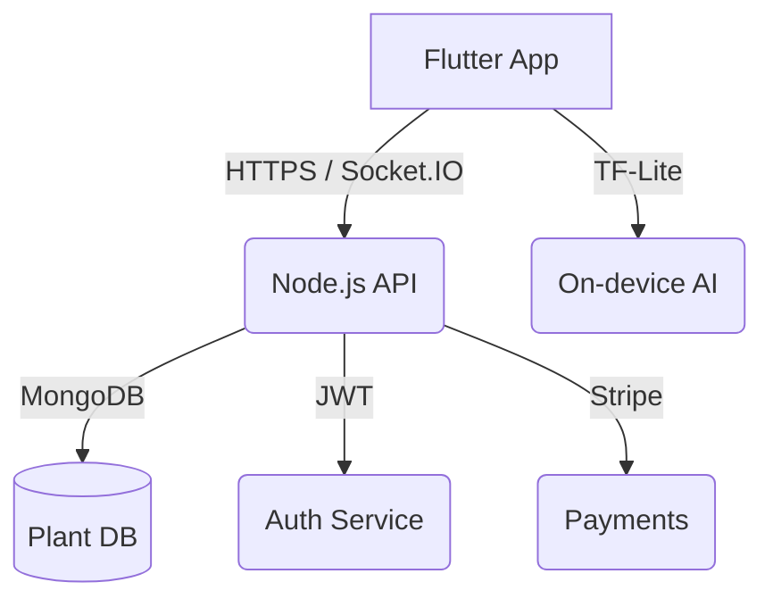

# 🌿 **AI Plant Care – README**  
*Smart plant care powered by Flutter, Node.js & AI.*

---

### 🚀 **Live Demo**
Visit the **web preview** at:  
🔗 **[https://ai-plant-care.web.app](https://ai-plant-care.web.app)** *(coming soon)*  

---

## 📱 **What is AI Plant Care?**
A **mobile-first** ecosystem that helps users **diagnose plant diseases**, **chat with doctors**, **buy medicines**, and **track appointments** – all in one Flutter app backed by a **Node.js + Socket.IO** backend.

---

## ✨ **Core Features**
| Feature | Tech |
|---|---|
| 🌱 **AI Plant Diagnosis** | TensorFlow Lite + Flutter |
| 💬 **Real-Time Chat** | Socket.IO + Flutter |
| 🛒 **Marketplace** | Stripe + Cart |
| 📆 **Doctor Appointments** | Calendar + Notifications |
| 🎖️ **Loyalty Rewards** | Points & Redemption |
| 🧑‍⚕️ **Admin Panel** | Web Dashboard |

---

## 🎨 **Screenshots**
<p align="center">
  
  
  
  
  
</p>

---

## ⚙️ **Architecture**


---

## 🛠️ **Tech Stack**
| Layer | Stack |
|---|---|
| **Frontend** | Flutter (Bloc), Rive Animations |
| **Backend** | Node.js, Express, Socket.IO |
| **Database** | MongoDB Atlas |
| **Auth** | JWT + `flutter_secure_storage` |
| **Payments** | Stripe |
| **AI** | TensorFlow Lite |
| **CI/CD** | GitHub Actions → Firebase Hosting |

---

## 📦 **Installation**

### 1️⃣ Backend
```bash
git clone https://github.com/your-org/ai-plant-backend.git
cd ai-plant-backend
npm install
cp .env.example .env
npm run dev
```

### 2️⃣ Flutter
```bash
git clone https://github.com/your-org/ai-plant-app.git
cd ai-plant-app
flutter pub get
flutter run
```

---

## 🔐 **Environment Variables (.env)**
```bash
PORT=5000
MONGO_URI=mongodb+srv://...
JWT_SECRET=super-secret
STRIPE_SECRET_KEY=sk_test_...
```

---

## 🌐 **API Endpoints**
| Method | Endpoint | Description |
|---|---|---|
| `POST` | `/api/auth/login` | Login & receive token + user |
| `POST` | `/api/auth/signup` | Register new user |
| `GET`  | `/api/chat/community` | Community chat history |
| `WS`   | `/socket.io` | Real-time messages |
| `GET`  | `/api/diagnosis` | AI prediction |
| `POST` | `/api/appointments` | Book doctor slot |

Full Swagger docs at: `https://api.ai-plant-care.com/docs`

---

## 🧪 **Testing**
```bash
# Backend tests
npm test

# Flutter tests
flutter test
flutter test integration_test/
```

---

## 🤝 **Contributing**
1. Fork the repo  
2. Create a feature branch (`git checkout -b feature/awesome`)  
3. Commit & push  
4. Open a Pull Request 🎉

---

## 📜 **License**
MIT © [Your Name](https://github.com/your-org)

---

<p align="center">
  Made with ❤️ and 🌿 by the **AI Plant Care Team**
</p>
